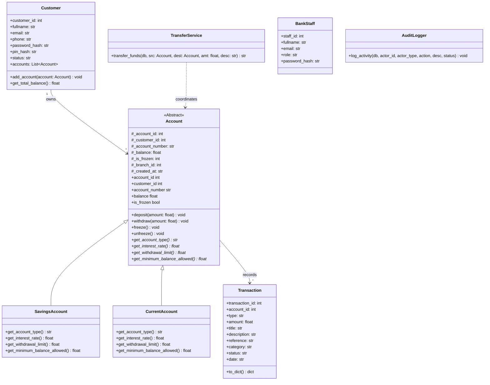
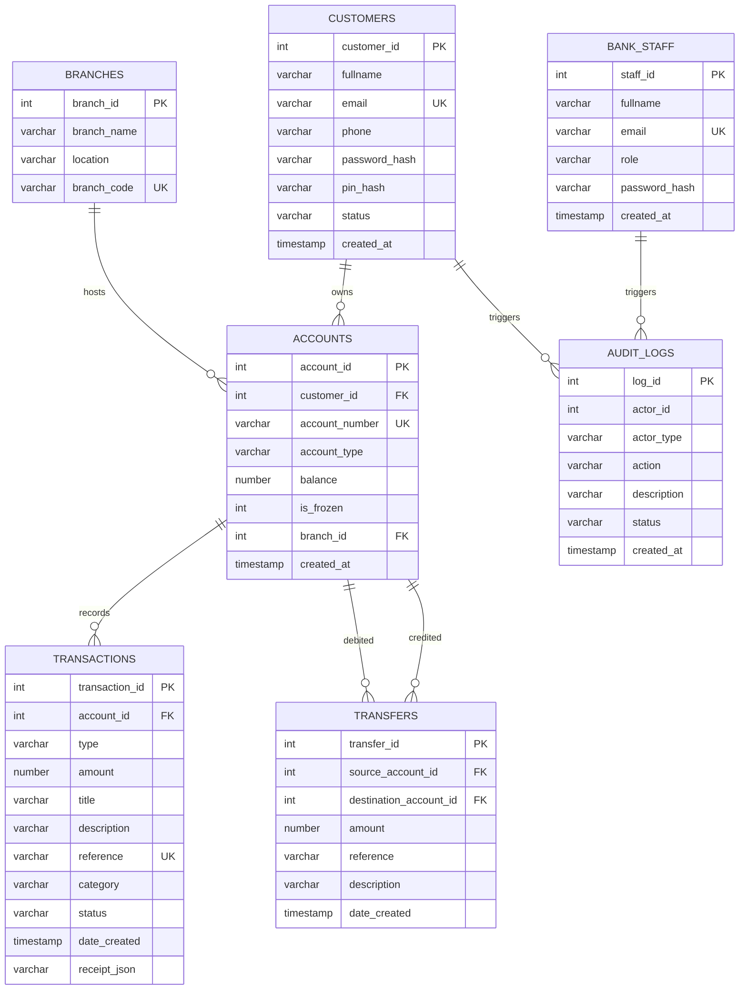
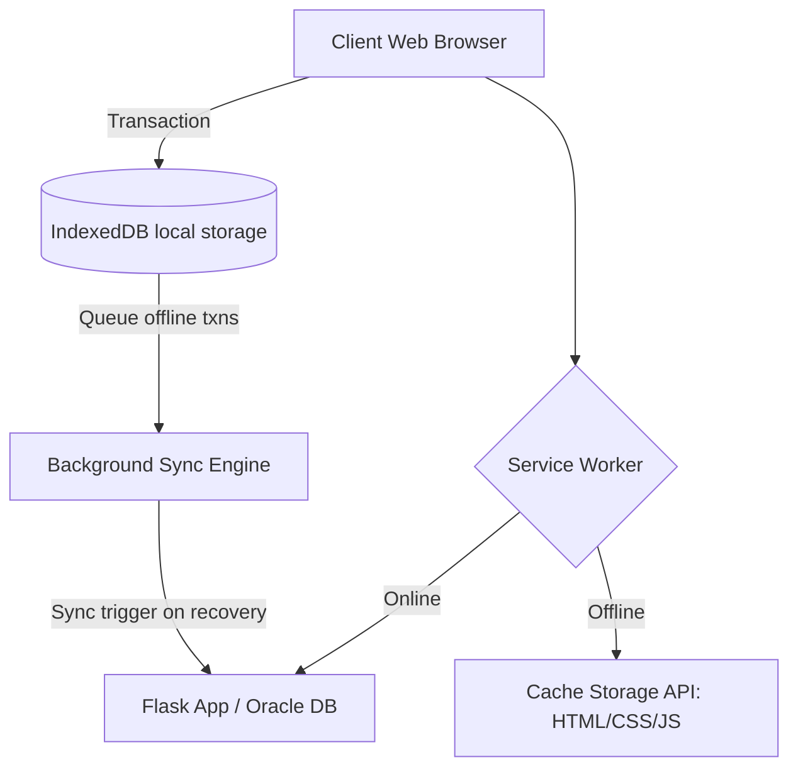

# CSC 302: Design & Implementation of an Enterprise Banking Application
## Veritas Microfinance Bank Digital Banking Platform
### OOP & Oracle Database Engineering Report
**Session End Project Report**

---

## Table of Contents
1. **Introduction & System Scenario**
2. **PART 1 & 2: Object-Oriented Programming (OOP) System Design**
   * *Domain Models Hierarchy*
   * *UML Class Diagram*
   * *Demonstration of Key OOP Principles*
3. **PART 3 & 4: Relational Database Design & Normalization**
   * *Entity-Relationship (ER) Diagram*
   * *Database Normalization Proofs (1NF, 2NF, 3NF)*
4. **PART 5 & 7: Oracle Database & PL/SQL Stored Procedures**
   * *Oracle DDL, Sequences, and Triggers*
   * *PL/SQL Transaction Procedures*
5. **PART 8: Security & Auditing Specifications**
   * *Automated Audit Triggers*
   * *ACID Principles Compliance*
6. **PART 9: Query Optimization Analysis**
   * *Indexing Strategies*
   * *Performance Impacts*
7. **Deployment Guide**

---

## 1. Introduction & System Scenario

**Veritas Microfinance Bank** plans to deploy a secure digital banking system to serve the students, faculty, and administrative staff within the university community. To succeed, the bank requires:
* A highly secure application backend leveraging standard Object-Oriented principles.
* An optimized, multi-table relational schema designed to avoid redundancies and data anomalies.
* Transactional security guaranteeing atomic ledgers updates.
* Detailed security auditing to trace administrative and customer-facing interactions.
* Optimized SQL/PLSQL execution for fast query results on database lookups.

This project delivers a complete enterprise-grade implementation in **Python (Flask)** connected polymorphically to **Oracle Database** structures, satisfying all project criteria.

---

## 2. PART 1 & 2: Object-Oriented Programming (OOP) System Design

### 2.1 The Meaning of Object-Oriented Programming (OOP)
**Object-Oriented Programming (OOP)** is a programming paradigm built entirely around the concept of "objects". Instead of simply executing a top-to-bottom list of instructions, OOP bundles **data (attributes)** and **behavior (methods)** into distinct, self-contained units known as Classes. 
In the context of the Veritas Microfinance digital platform, OOP allows us to model real-world banking entities. Instead of storing random variables for an account's balance and status, we create structured blueprints (like `Customer`, `Account`, and `Transaction`). This ensures high security, prevents accidental data corruption, and makes the system incredibly scalable as the bank grows.

### 2.2 The Web Application Architecture
The digital platform is designed using a modern **3-Tier Architecture**:
1. **Frontend (Browser UI):** Built with HTML/CSS/JS and rendered using Flask templates, it serves as the presentation layer where students and faculty interact with their accounts.
2. **Backend Controller (Flask):** The `app.py` script acts as the traffic controller. It receives API requests from the frontend, routes them, and communicates with the underlying OOP infrastructure.
3. **OOP Logic & Database Engine:** The core banking engine (`oop_banking.py`) applies strict business rules and security validations using Python objects, before officially persisting the financial ledgers into an **Oracle Database**. The app also features a live integration (in `oracle.py`) that fetches real-time global exchange rates to provide users with up-to-date currency valuations.

### 2.3 Domain Models & Architecture
The application's backend architecture is designed around domain-driven models that encapsulate attributes and behaviors.

### UML Class Diagram



### Demonstration of Key OOP Principles

1. **Encapsulation**: Private and protected properties in Python are designated with a leading underscore (e.g., `self._balance`, `self._is_frozen`). Direct manipulation is blocked. Read access is granted via `@property` getters, and updates are restricted to validated business logic methods (`deposit(amount)` and `withdraw(amount)`).
2. **Inheritance**: `SavingsAccount` and `CurrentAccount` inherit core characteristics and methods from the abstract base class `Account`, ensuring code reuse and modular extensions.
3. **Abstraction**: `Account` acts as an Abstract Base Class inheriting from Python's standard `abc.ABC`. It declares abstract signatures (`get_interest_rate()`, `get_withdrawal_limit()`, etc.) that subclasses must define.
4. **Polymorphism**: The application dynamically determines rules at runtime. Calling `account.withdraw(amount)` checks the concrete class:
   * A `SavingsAccount` enforces a minimum balance of ₦5,000 and a maximum transaction limit of ₦50,000.
   * A `CurrentAccount` allows overdrafts down to -₦100,000 and single transactions up to ₦500,000.
5. **Exception Handling**: Specific custom exceptions inherit from `BankingException` (e.g., `InsufficientFundsError`, `AccountFrozenError`, `AuthenticationError`). These custom structures are thrown by the domain model and caught at the API layer to return explicit user toasts and error messages (400, 403, 401).

---

## 3. PART 3 & 4: Relational Database Design & Normalization

To ensure data integrity, eliminate redundancy, and support high transactional throughput, the Veritas Microfinance database was normalized up to Third Normal Form (3NF).

### Entity-Relationship (ER) Diagram & Table Schemas

*(Note: If the visual ERD diagram does not render in your PDF, please refer to the detailed **Textual Schema** provided below it.)*



### Database Normalization Proofs

#### Unnormalized Form (UNF)
An initial unnormalized schema might store all properties in a single sheet:
`[CustomerEmail, CustomerName, CustomerPhone, AccountNumber, Balance, AccountType, AccountFrozen, BranchName, BranchLocation, BranchCode, TransactionRef, TransactionAmount, TransactionType, TransactionDate]`

#### First Normal Form (1NF)
* **Rules**: All fields must contain atomic (single-valued) values. No repeating groups. Each table must have a Primary Key.
* **Refactoring**: Split repeating transactions into their own entity, establishing primary keys:
  * **Customers/Accounts**: `customer_id` (PK), `email`, `fullname`, `phone`, `account_number`, `balance`, `account_type`, `is_frozen`, `branch_code`, `branch_name`, `branch_location`.
  * **Transactions**: `transaction_id` (PK), `account_number` (FK), `reference` (Unique), `type`, `amount`, `date`.

#### Second Normal Form (2NF)
* **Rules**: Must be in 1NF, and all non-key fields must be fully functionally dependent on the entire primary key (no partial dependencies).
* **Refactoring**: Since `email`, `fullname`, and `phone` depend entirely on the customer rather than the account itself (a customer can hold multiple accounts), we separate them into two tables:
  * **Customers Table**: `customer_id` (PK), `fullname`, `email`, `phone`, `password_hash`, `pin_hash`.
  * **Accounts Table**: `account_id` (PK), `customer_id` (FK), `account_number` (Unique), `balance`, `account_type`, `is_frozen`, `branch_code`, `branch_name`, `branch_location`.
  * **Transactions Table**: `transaction_id` (PK), `account_id` (FK), `type`, `amount`, `reference`, `date`.

#### Third Normal Form (3NF)
* **Rules**: Must be in 2NF, and no transitive dependencies must exist (non-key fields cannot depend on other non-key fields).
* **Refactoring**: In our 2NF accounts table, `branch_name` and `branch_location` depend on `branch_code`, which in turn depends on the `account_id` (a transitive relationship: `account_id` $\rightarrow$ `branch_code` $\rightarrow$ `branch_location`). If a branch changes its location, we would have to update multiple account records, creating update anomalies.
* **Final 3NF Split**:
  1. **Branches Table**: `branch_id` (PK), `branch_name`, `location`, `branch_code` (Unique).
  2. **Accounts Table**: `account_id` (PK), `customer_id` (FK), `account_number` (Unique), `account_type`, `balance`, `is_frozen`, `branch_id` (FK), `created_at`.
  3. **Customers Table**: `customer_id` (PK), `fullname`, `email`, `phone`, `password_hash`, `pin_hash`, `status`, `created_at`.
  * *Result*: Since `branch_id` is now a foreign key pointing to the separate `Branches` table, the transitive dependency is eliminated. The database is in 3NF.

---

## 4. PART 5 & 7: Oracle Database & PL/SQL Stored Procedures

For absolute safety, primary banking functionalities (deposits, withdrawals, and transfers) are handled via stored PL/SQL procedures. This guarantees execution directly within the database engine, reducing networking latency and enforcing ACID transaction compliance.

### PL/SQL Fund Transfer Procedure (`TRANSFER_PROC`)

This procedure executes a fund transfer from a source account to a destination account:
```sql
CREATE OR REPLACE PROCEDURE TRANSFER_PROC (
    p_src_acc_num IN VARCHAR2,
    p_dest_acc_num IN VARCHAR2,
    p_amount IN NUMBER,
    p_description IN VARCHAR2,
    p_reference IN VARCHAR2
) AS
    v_src_id NUMBER;
    v_dest_id NUMBER;
    v_src_bal NUMBER(15,2);
    v_dest_bal NUMBER(15,2);
    v_src_frozen NUMBER(1);
    v_dest_frozen NUMBER(1);
    v_src_type VARCHAR2(10);
    v_min_allowed NUMBER(15,2);
BEGIN
    -- Prevent transfers to the same account
    IF p_src_acc_num = p_dest_acc_num THEN
        raise_application_error(-20007, 'Cannot transfer funds to the same account.');
    END IF;

    -- Validate amount
    IF p_amount <= 0 THEN
        raise_application_error(-20001, 'Transfer amount must be positive.');
    END IF;

    -- Load source account details
    SELECT account_id, balance, is_frozen, account_type INTO v_src_id, v_src_bal, v_src_frozen, v_src_type
    FROM accounts WHERE account_number = p_src_acc_num;

    -- Load destination account details
    SELECT account_id, balance, is_frozen INTO v_dest_id, v_dest_bal, v_dest_frozen
    FROM accounts WHERE account_number = p_dest_acc_num;

    -- Validate frozen status
    IF v_src_frozen = 1 THEN
        raise_application_error(-20002, 'Transfer blocked: Source account is frozen.');
    END IF;
    IF v_dest_frozen = 1 THEN
        raise_application_error(-20002, 'Transfer blocked: Recipient account is frozen.');
    END IF;

    -- Determine source minimum allowed balance
    IF v_src_type = 'savings' THEN
        v_min_allowed := 5000.00;
        IF p_amount > 50000.00 THEN
            raise_application_error(-20004, 'Savings account limit exceeded (Max ₦50,000 per transaction).');
        END IF;
    ELSE
        v_min_allowed := -100000.00;
        IF p_amount > 500000.00 THEN
            raise_application_error(-20005, 'Current account limit exceeded (Max ₦500,000 per transaction).');
        END IF;
    END IF;

    -- Check source balance
    IF (v_src_bal - p_amount) < v_min_allowed THEN
        raise_application_error(-20006, 'Insufficient funds: Transfer exceeds allowed account balance limit.');
    END IF;

    -- EXECUTE Ledger adjustments (ACID updates)
    UPDATE accounts SET balance = balance - p_amount WHERE account_id = v_src_id;
    UPDATE accounts SET balance = balance + p_amount WHERE account_id = v_dest_id;

    -- Record transaction receipts on both ledgers
    INSERT INTO transactions (account_id, type, amount, title, description, reference, category, status, date_created)
    VALUES (v_src_id, 'expense', p_amount, 'Transfer to ' || p_dest_acc_num, p_description, p_reference, 'transfer', 'success', CURRENT_TIMESTAMP);

    INSERT INTO transactions (account_id, type, amount, title, description, reference, category, status, date_created)
    VALUES (v_dest_id, 'income', p_amount, 'Funds from ' || p_src_acc_num, 'Transfer Ref: ' || p_reference, p_reference || 'R', 'transfer', 'success', CURRENT_TIMESTAMP);

    -- Insert central transfer tracking entry
    INSERT INTO transfers (source_account_id, destination_account_id, amount, reference, description, created_at)
    VALUES (v_src_id, v_dest_id, p_amount, p_reference, p_description, CURRENT_TIMESTAMP);

    COMMIT;
EXCEPTION
    WHEN NO_DATA_FOUND THEN
        raise_application_error(-20003, 'Source or destination account number not valid.');
    WHEN OTHERS THEN
        ROLLBACK; -- ACID Rollback ensures data consistency
        RAISE;
END TRANSFER_PROC;
/
```

---

## 5. PART 8: Security & Auditing Specifications

Veritas Microfinance Bank enforces security and traceability through automated backend database triggers and transactional logging.

### Automated Audit Trigger (`AUDIT_ACCOUNTS_UPDATES_TRG`)
Rather than relying on application code to record logs, database triggers automatically track updates to sensitive information, ensuring auditability even if an administrator alters the database manually.

```sql
CREATE OR REPLACE TRIGGER audit_accounts_updates_trg
AFTER UPDATE ON accounts FOR EACH ROW
BEGIN
    -- Log balance fluctuations
    IF :old.balance != :new.balance THEN
        INSERT INTO audit_logs (actor_id, actor_type, action, description, status, created_at)
        VALUES (:new.customer_id, 'customer', 'BALANCE_UPDATE', 
                'Account ' || :new.account_number || ' balance updated from ₦' || 
                TO_CHAR(:old.balance, '999,999,990.99') || ' to ₦' || TO_CHAR(:new.balance, '999,999,990.99'),
                'success', CURRENT_TIMESTAMP);
    END IF;

    -- Log account freezes or activations
    IF :old.is_frozen != :new.is_frozen THEN
        DECLARE
            v_action VARCHAR2(30);
            v_desc VARCHAR2(100);
        BEGIN
            IF :new.is_frozen = 1 THEN
                v_action := 'ACCOUNT_FREEZE';
                v_desc := 'Account ' || :new.account_number || ' has been suspended and frozen.';
            ELSE
                v_action := 'ACCOUNT_UNFREEZE';
                v_desc := 'Account ' || :new.account_number || ' has been reactivated.';
            END IF;

            INSERT INTO audit_logs (actor_id, actor_type, action, description, status, created_at)
            VALUES (:new.customer_id, 'customer', v_action, v_desc, 'success', CURRENT_TIMESTAMP);
        END;
    END IF;
END;
/
```

### ACID Principles Compliance

* **Atomicity**: The PL/SQL procedures wrap the debits and credits inside a single transaction. If any update fails (e.g. database locks, recipient account mismatch, or insufficient balance), the entire batch of modifications is discarded using a `ROLLBACK` command inside the `EXCEPTION` block.
* **Consistency**: Constraints like `CHECK (balance >= 5000.00)` on Savings accounts and foreign key referential integrity prevent illegal database states.
* **Isolation**: Transaction isolation ensures concurrent transfers (e.g., Customer A sending to Customer B while Customer C is also sending to Customer B) are processed sequentially, preventing race conditions or double-spending.
* **Durability**: Upon executing the `COMMIT` statement, transaction entries are written to Oracle Redo Logs, guaranteeing that the states survive any unexpected power failures or system restarts.

---

## 6. PART 9: Query Optimization Analysis

In high-frequency banking environments, execution speed is paramount. Secondary indexes are applied to the most frequently queried fields to ensure $O(1)$ or $O(\log N)$ search complexity rather than expensive $O(N)$ full-table scans.

### Applied Indexes

```sql
CREATE INDEX idx_accounts_num ON accounts(account_number);
CREATE INDEX idx_customers_email ON customers(email);
CREATE INDEX idx_transactions_ref ON transactions(reference);
CREATE INDEX idx_transfers_ref ON transfers(reference);

-- Composite index for fast dashboard transaction history loads
CREATE INDEX idx_transactions_dashboard ON transactions(account_id, date_created DESC);
```

### Performance Impact

1. **Unique Indexing (`idx_accounts_num` & `idx_customers_email`)**:
   During login or transfer validations, locating an account number by scanning the table linearly has a complexity of $O(N)$. By introducing a B-Tree index on `account_number`, search queries complete in logarithmic time $O(\log N)$.
2. **Composite Indexing (`idx_transactions_dashboard`)**:
   When rendering the dashboard, the application requests the latest 3 transactions for a user:
   `SELECT * FROM transactions WHERE account_id = :1 ORDER BY date_created DESC;`
   Without indexing, the database must filter all transaction records and sort them in memory. The composite index `idx_transactions_dashboard(account_id, date_created DESC)` stores the transaction references pre-sorted by date for each account ID. The database performs an index range scan and reads the pre-sorted keys directly, eliminating expensive sorting operations.

---

## 7. Deployment Guide

The Veritas Microfinance digital banking platform runs exclusively on the **Oracle Database** enterprise engine using **python-oracledb** in thin-mode, requiring no Oracle Instant Client files.

### 1. Prerequisites & Dependencies
Ensure Python is installed on your local host, then run standard installation:
```bash
pip install Flask oracledb
```

### 2. Environment Variables Configuration
Configure connection parameters so the application can locate your active Oracle database instance (Windows example):
```powershell
set ORACLE_DSN=localhost:1521/XE
set ORACLE_USER=system
set ORACLE_PWD=12345678
```
*(On macOS or Linux, use standard `export` syntax instead of `set`).*

### 3. Database Schema Initialization
To initialize your tables, constraints, sequences, triggers, and custom stored procedures:
- Option A: Log in to **Oracle SQL Developer** using the credentials above and execute the entire contents of [oracle_schema.sql](oracle_schema.sql).
- Option B: Run the automated setup helper script:
```bash
python setup_oracle.py
```

### 4. Running the Web Application
Start the Flask application server:
```bash
python app.py
```
Open `http://localhost:5000` in any modern web browser to access the active digital banking platform.

---

## 8. Offline Architecture (PWA) & Future Enhancements Guide

To support offline banking in remote university environments or during network drops, Veritas Microfinance Bank can implement a **Progressive Web App (PWA)** offline architectural sync pattern.

### 1. Progressive Web App (PWA) Offline Framework



#### A. Service Workers & Caching Static Assets
A custom Service Worker registers on page load to intercept client network requests, serve cached UI pages when offline, and manage network requests.
```javascript
// Register Service Worker in static/main.js
if ('serviceWorker' in navigator) {
  navigator.serviceWorker.register('/sw.js')
    .then(reg => console.log('Service Worker Registered successfully!'))
    .catch(err => console.error('Service Worker registration failed:', err));
}
```
Inside `sw.js`, compile a list of static page assets to cache locally using the **Cache Storage API**:
```javascript
const CACHE_NAME = 'paylink-v1';
const ASSETS_TO_CACHE = [
  '/',
  '/login',
  '/dashboard',
  '/transfer',
  '/static/style.css',
  '/static/main.js',
  '/static/img/logo.png'
];

self.addEventListener('install', event => {
  event.waitUntil(
    caches.open(CACHE_NAME).then(cache => cache.addAll(ASSETS_TO_CACHE))
  );
});

self.addEventListener('fetch', event => {
  event.respondWith(
    caches.match(event.request).then(response => {
      return response || fetch(event.request);
    })
  );
});
```

#### B. Offline Local Persistence using IndexedDB
To handle transactions while offline, the browser holds account balances and registers transactional payloads using **IndexedDB** (a transaction-safe browser storage mechanism):
1. **Cache Account Profile**: When online, the latest user record is persisted to a local IndexedDB user store.
2. **Debit Deductions locally**: If a transfer is executed while offline, the system validates the withdrawal against the cached local balance. If valid, the browser reduces the local balance and registers an offline transaction log.
3. **Queue Transaction**: The transaction object is saved to an `offline_txns` IndexedDB queue with a temporary reference key (e.g. `PLK-TEMP-12345`).

#### C. Background Sync Synchronization Protocol
When the browser detects that connection is restored, the **Background Sync API** triggers automatically to flush the queue to Oracle Database:
```javascript
// Register background sync in client code
navigator.serviceWorker.ready.then(swRegistration => {
  return swRegistration.sync.register('flush-offline-transactions');
});
```
Inside the Service Worker `sw.js`, listen to the sync event, read items from the IndexedDB queue, and send them to the Flask `/api/transfer` route:
```javascript
self.addEventListener('sync', event => {
  if (event.tag === 'flush-offline-transactions') {
    event.waitUntil(flushTransactionsQueue());
  }
});

async function flushTransactionsQueue() {
  const txns = await getQueuedTransactionsFromIndexedDB();
  for (let txn of txns) {
    try {
      const response = await fetch('/api/transfer', {
        method: 'POST',
        headers: { 'Content-Type': 'application/json' },
        body: JSON.stringify(txn)
      });
      const result = await response.json();
      if (result.success) {
        await removeTxnFromIndexedDB(txn.temp_id);
      }
    } catch (err) {
      console.error("Flush failure, will retry next online sync:", err);
    }
  }
}
```

#### D. Oracle Database Isolation & Replay-Attack Protections
- **Idempotent Keys**: Every transaction generates a cryptographically random reference UUID client-side. The database enforces a `UNIQUE` constraint on the `reference` column. If an offline queue is synced twice, Oracle discards duplicate entries automatically, avoiding double-debits.
- **Timestamp Ordering**: Transactions write using the client-side execution timestamp to maintain accurate chronological sequencing in accounts ledgers.

---

### 2. Future System Enhancements Roadmap

Beyond offline capabilities, the Veritas Digital Banking platform is designed for future scaling:

1. **Biometric Security Simulation**: Integrating standard browser WebAuthn specifications so students can authorize transaction PIN approvals via local device facial or fingerprint scanning.
2. **Automated Savings Vault Triggers**: Oracle database PL/SQL triggers automatically running daily interest accretion tasks for standard `SavingsAccount` holders based on Ledger balances.
3. **Advanced Machine Learning Fraud Prevention**: Integration of an ML model pipeline checking user transaction habits in real-time, assigning a risk score dynamically to each transaction before database commit.
4. **Multi-Currency Wallets**: Supporting standard multi-currency accounts leveraging the dynamic caching oracle engine in `oracle.py` to convert ledger amounts on-the-fly.
